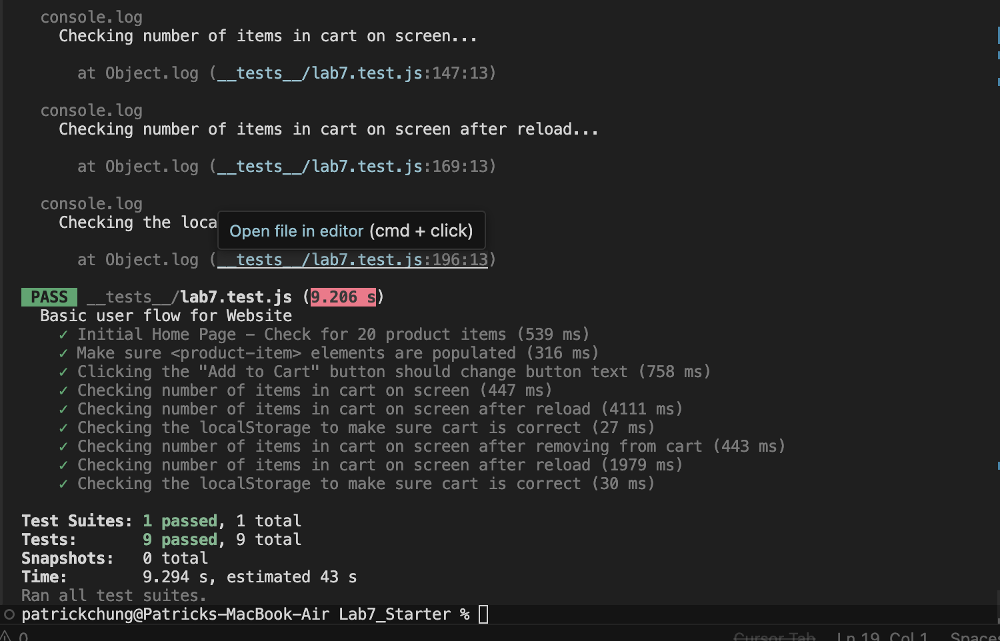

# Lab 7 - Unit & E2E Testing

## Team
- Patrick Chung

## Check Your Understanding

**1) Where would you fit your automated tests in your Recipe project development pipeline?**

Within a GitHub Action that runs whenever code is pushed. This way tests run automatically on every push without relying on anyone remembering to run them manually. It catches bugs before they make it into the main branch and keeps the whole team accountable since the CI result is visible to everyone. Corners can be cut when running manually, atleast with CI we can enforce strict tests and edge cases. 

**2) Would you use an end to end test to check if a function is returning the correct output?**

No. E2E tests simulate user flows through the browser from start to finish. Checking that a function returns the correct output is the job of a unit test, which tests individual functions in isolation.

**3) What is the difference between navigation and snapshot mode?**

Navigation mode analyzes the page right after it loads and gives an overall performance metric including JavaScript execution time. Snapshot mode analyzes the page in its current state and is best for finding accessibility issues, but it cannot measure JS performance or changes to the DOM.

**4) Name three things we could do to improve the CSE 110 shop site based on the Lighthouse results.**

1. Minify JavaScript and reduce unused JavaScript
2. Avoid chaining critical requests
3. Use efficient cache lifetimes

## Test Results
